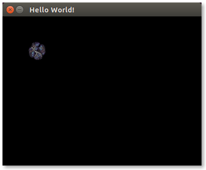

Pygame-SDL2
===========

Pygame-SDL2 is a project that aims to be a drop-in replacement for Pygame
that uses pysdl2 as its backend, and aims to create an even simpler API
than Pygame for creating games. To start using Pygame-SDL2 with your existing
Pygame project, all you need to do is change your pygame import from this:

```import pygame```

to this:

```import pygame2 as pygame```

Right now only basic pygame methods have been re-implemented, and thus
is not yet appropriate to fully replace Pygame at this time.


Requirements
============

* pysdl2
* pymunk


Example
=======



```python
#!/usr/bin/python
import pygame2 as pygame
import sys
import time
from pygame2.locals import *

pygame.init()
screen = pygame.display.set_mode((400, 300))
pygame.display.set_caption('Hello World!')

asteroid = pygame.image.load('asteroid_1.png')

while True: # main game loop
    for event in pygame.event.get():
        if event.type == QUIT:
            pygame.quit()
            sys.exit()

    screen.fill((0,0,0))
    screen.blit(asteroid, (50, 50))
    pygame.display.update()
```
